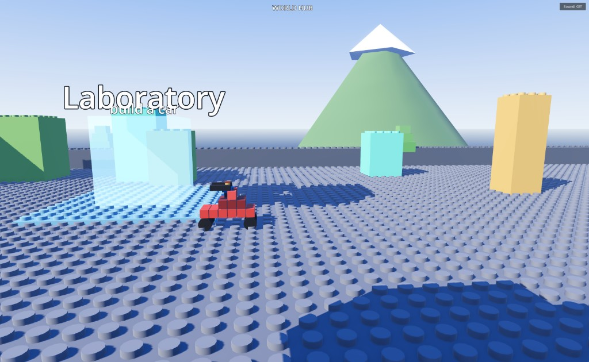
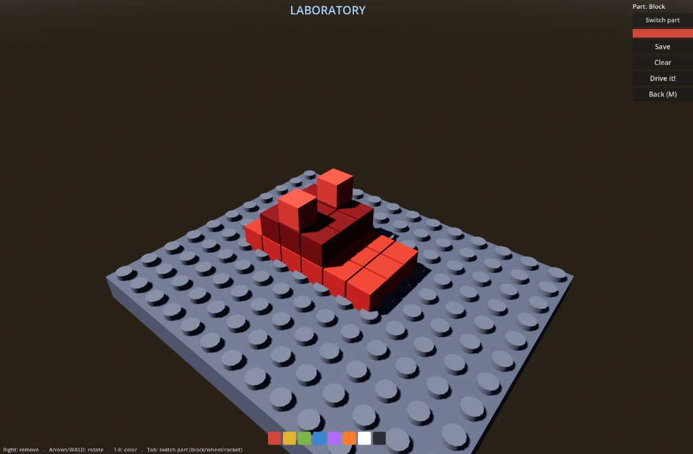
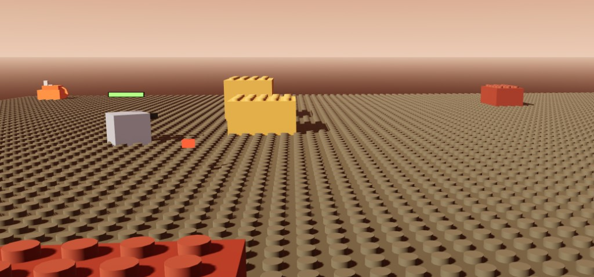

# Brick Stunt Rally 🧱🚗

A little 3D brick-car game I've been building in **Godot 4**. You drive blocky cars
through stunt courses, blow stuff up with rockets, build your own vehicles brick by
brick in a Laboratory, and collect a garage full of cars. It started as a "let me
try Godot for a weekend" thing and kind of refused to stop growing.



## Why I made this

Honestly? I just wanted to drive a tiny Lego-ish car off a ramp and watch it flip.
That was the whole pitch in my head. Then I added a loop. Then I wanted *worlds*.
Then I thought "what if the car had a rocket on the roof" and there was no going
back. Every evening I'd tell myself "one more small thing" and end up three hours
deep tuning suspension springs or arguing with myself about how a wheel should feel
on a bumpy road.

I'm not a studio, it's just me. A lot of this was trial and error — driving the same
test ramp a hundred times, nudging a number, driving it again. The car physics in
particular took forever to feel *right* (grippy but still fun, springy but not
bouncy-castle). I'm pretty proud of where it landed.

## What's in it

- **Drive-anywhere arcade cars** — full 3D ground driving with tire grip, springy
  suspension, body lean into corners, and the freedom to roam a wide world.
- **A hub world you drive around** — no clicky menus. You steer your car into a
  glowing portal, hold for a couple seconds, and it charges up and warps you in.
- **Four themed worlds**, 10 levels each, getting harder as you go — Grassland,
  Desert (with proper sand dunes), Neon City, and a **War Zone**. Levels are
  generated with ramps, gaps, hazards, moving platforms, spinning arms and loops.
- **Rockets & combat** — roof-mounted launchers fire actual rockets with fire
  trails that explode on impact. Real area blasts that fling bricks around, enemy
  types (drones, turrets, tanks) with health bars, and floating damage numbers.
- **A Laboratory where you build your own car** brick by brick — pick blocks,
  wheels and rockets, paint them, and drive your creation everywhere.
- **A Parking lot / garage** — you start with two cars and win a new one every time
  you finish a world. Walk up to any car on foot and hop in.
- **Get out and walk** — there's a little brick character (you can see the driver
  in the car). Press E to get out, wander around, jump with Space, get back in.
- **Nice scenery** — sun, snow-capped mountains, lego trees, drifting clouds, all
  themed per world.
- **No external assets.** Every model, every sound, every level is generated in
  code. The "studded bricks" are deliberately generic — this isn't affiliated with
  any toy company, just inspired by the joy of clicking bricks together.





## Controls

| Key | What it does |
| --- | --- |
| Arrow keys / WASD | Drive (and rotate the view in the Laboratory) |
| Space / F | Fire rockets · (jump when you're on foot) |
| E | Get out of / into the car |
| Enter | Skip the portal charge-up / continue after a level |
| R | Restart the level |
| M / Esc | Back out (level → world map → hub) |

There's a **Sound** toggle in the top-right of every screen (it starts muted).

## Running it

You'll need [Godot 4](https://godotengine.org/) (built on 4.6).

```bash
# open it in the editor and press F5
godot project.godot

# or just run it
open -a Godot --args --path .   # macOS
```

## A peek under the hood

Everything is procedural and code-driven, which made it really fun to iterate on:

- `scripts/vehicle.gd` — the arcade car: raycast-wheel suspension, tire grip, body
  lean, and it rebuilds its whole body/wheels/rockets from your Laboratory design.
- `scripts/level_gen.gd` — generates every level (and the combat arenas) from a
  seed, scaling difficulty by world and level.
- `scripts/lab.gd` / `scripts/car_lib.gd` — the voxel car builder and the car catalog.
- `scripts/drive_scene.gd` — the shared base for every drivable scene (lighting,
  environment, camera, scenery, the portal/transition stuff).
- `scripts/enemy.gd`, `scripts/missile.gd`, `scripts/effects.gd` — combat, rockets
  and all the explosions.

If you poke around and find a way to make the cars feel even better, I'm all ears.

## Things I might still do

- Proper drive-able loop-the-loops (right now they're optional rings to the side)
- More car parts in the Lab (different wheel sizes, cannons, boosters)
- A bit of music
- Camera shake on the big explosions because why not

Thanks for checking it out. It was a blast to build. 🚀
